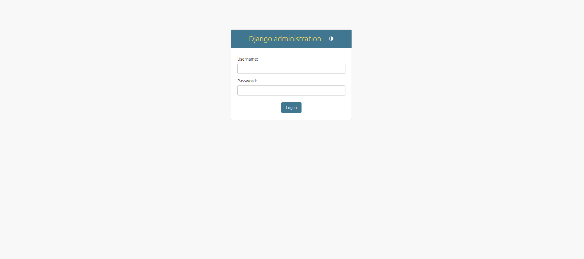
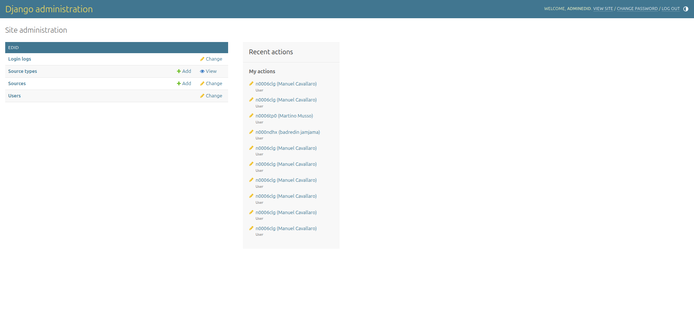
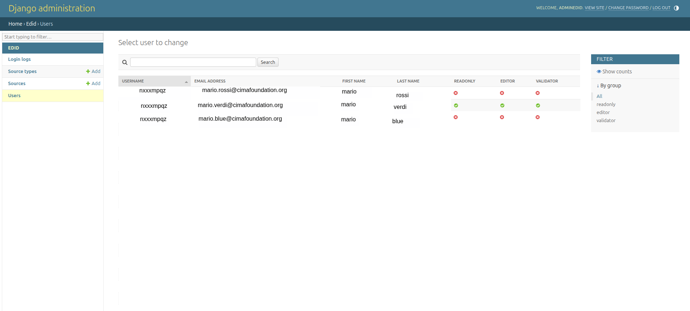
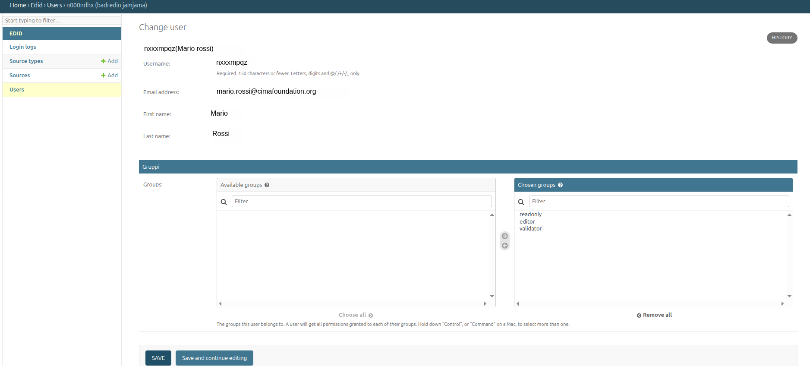
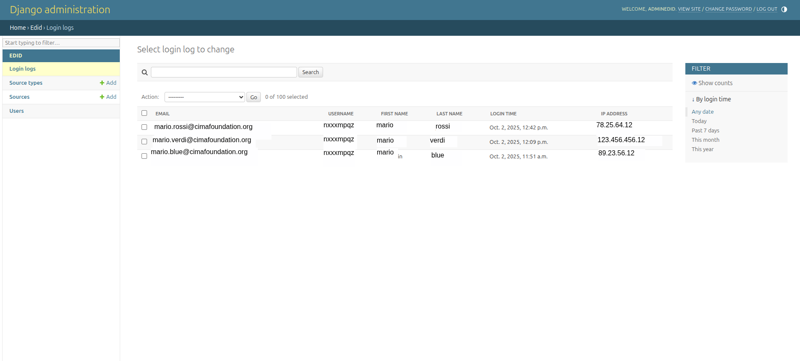
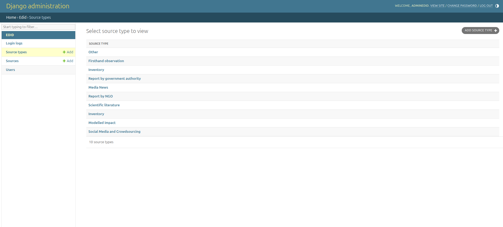
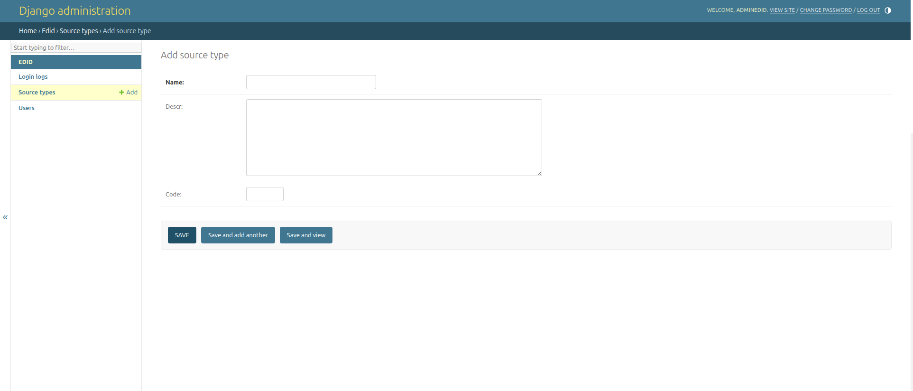

# **W-EDID Administrator Manual — Access Management in Django Admin**

## **1. Introduction**

This manual is intended for **W-EDID application administrators** who
are responsible for managing user access, assigning roles, adding source
types, and reviewing access logs.

The administrative interface is based on **Django Admin**, a secure and
dedicated web dashboard that allows authorized personnel to view and
modify application data efficiently.

Access to the Django Admin dashboard is restricted to administrators and
not all EDID users are permitted to log in.

## **2. Roles and permissions**

Users in W-EDID are assigned different roles, each with specific
authorization levels that determine what they can see and do within the
application.

## Read-only (View Only)

- Can log into the W-EDID application and view existing data.

- Cannot create, edit, or delete any records.

- In the Django Admin backend, this corresponds to having “view”
  permissions only, with no rights to modify or remove data.

## Editor

- Can access the W-EDID platform and create or edit data, including
  records such as sources and source types.

- Editors cannot validate data and do not have advanced administrative
  controls.

## Validator

- A specialized role with extended permissions.

- In addition to editing data, Validators can approve or validate
  information, confirming its accuracy and completeness.

- Typically assigned to users who oversee or supervise the work of other
  contributors.

## Administrator Role

The Administrator manages the entire user ecosystem and permissions.
This is the only role with access to the Django Admin dashboard, through
which they can assign user roles

## **3. Accessing the Django Admin Dashboard**

To log in to the administration dashboard:

1.  Open a browser (e.g., Chrome, Firefox, Edge).

2.  Go to your site’s address and add **/admin/** at the end of the URL
    ( http://edid-test.eu/admin/).

3.  The login page will appear. Enter your personal **username** and
    **password**.

4.  If your account has been enabled as staff, you will see the **Django
    Admin dashboard**.

5.  At the top-right corner, you will see your username and the link to
    log out.

## **4. Managing User Roles**

Through the Django Admin dashboard, administrators can view, assign and
edit user roles of all registered users in the system.

### **4.1 Visualising the user list**

- From the main menu, click **Users**.

- A table will be displayed with the list of all registered users.

- For each user you can see: full name, username, email address, and
  assigned role (readonly, editor, validator).

### **4.2 Creating a new user**

A new user can be added by registering through the EU Login system. Once
authorized via EU Login, the user will automatically appear in the
Django Admin dashboard.

From there, an administrator can assign the appropriate role to the
user—Read-only, Editor, or Validator—depending on the required level of
access within the platform.

### **4.3 Modifying an existing user**

1.  From the user list, click the person’s name.

2.  Change **only the** **Group** **field**. You can assign the user to
    one of the following role groups:

    - readonly

    - editor

    - validator

3.  Save your changes by clicking the **Save** button at the bottom of
    the
    page.

## **5. Managing Access Logs (LoginLog)**

The **LoginLog** automatically collects information about user logins:
email, first and last name, login date/time, IP address, and device
used.

### **5.1 Viewing logs**

- From the main menu, click **Login Logs**.

- A list will appear with all recorded login attempts.

### **5.2 Searching logs**

- You can sort by **login date** to see the most recent logins.

### **5.3 Rules for logs**

- Logs are used to guarantee the system’s security.

- They must **never be modified or deleted** by operators.

- Only the system administrator may intervene if technically required.  
  

## **6. Managing Source Types (SourceType)**

The **SourceType** model contains the different types of sources
available in the system.

### **6.1 Creating a new source type**

1.  Go to **Source Types**.(the button is located at the top right)

2.  Click **Add SourceType**.

3.  Fill in the fields:

    - **Name** (required)

    - **Description** (optional)

    - **Code** (optional, numeric identifier)

4.  Save to confirm.  
    

## **9. Logout**

When you have finished your work:

1.  Go to the top-right corner of the dashboard.

2.  Click **Logout**.

3.  You will be securely logged out of the system.
