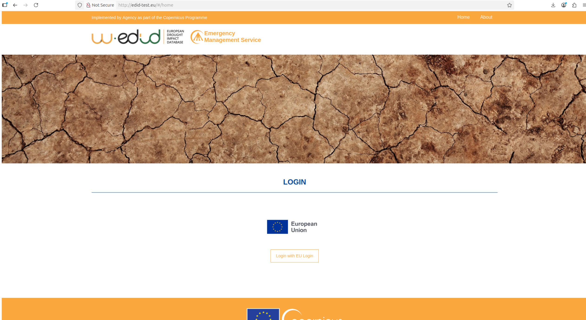
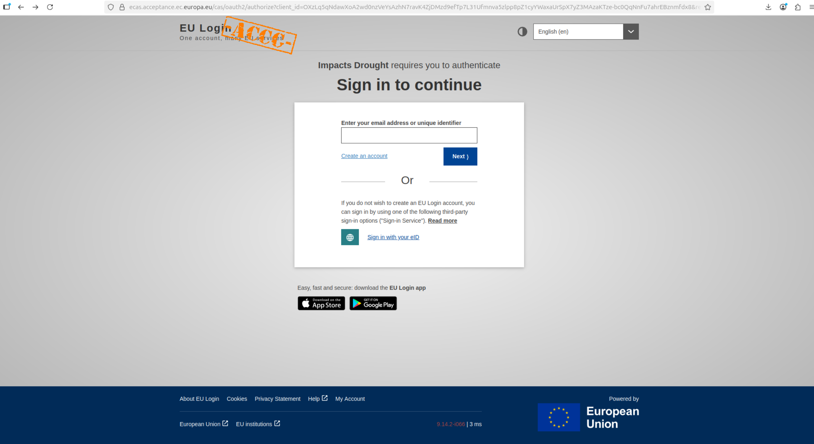
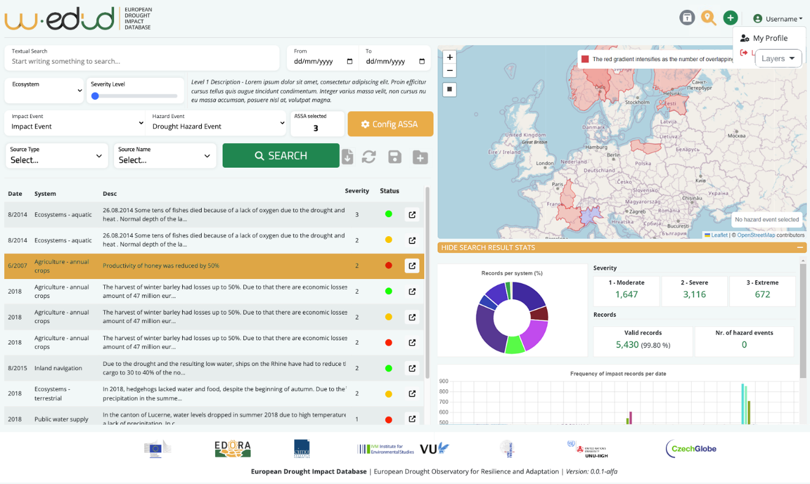
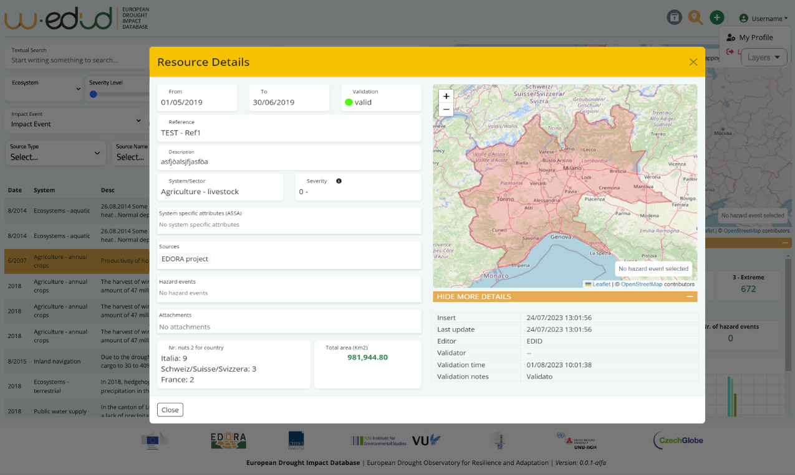
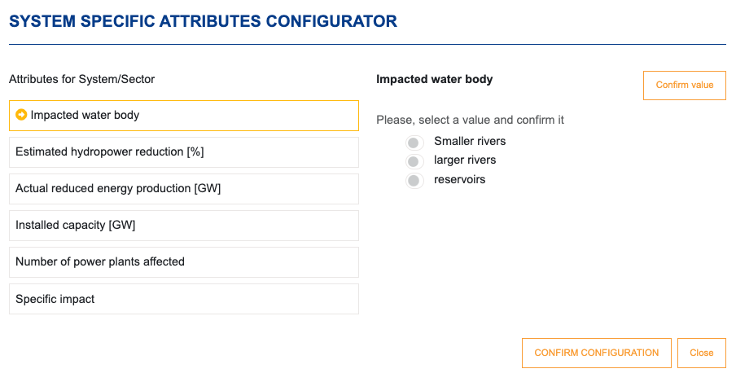
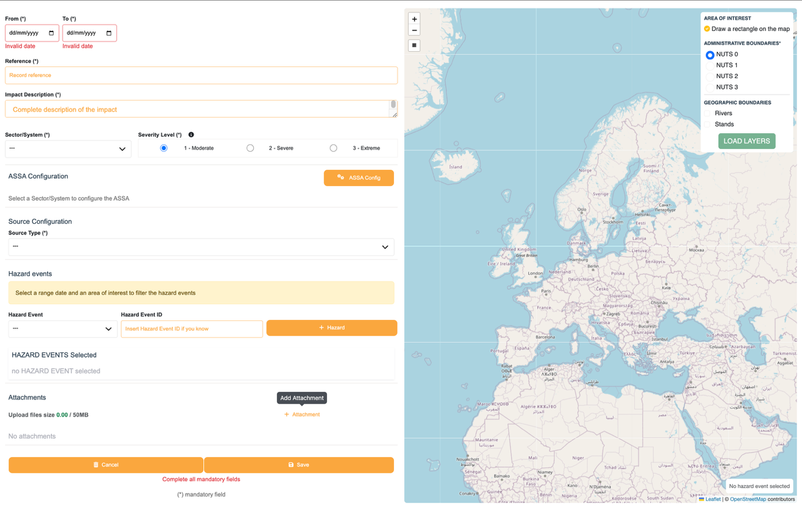
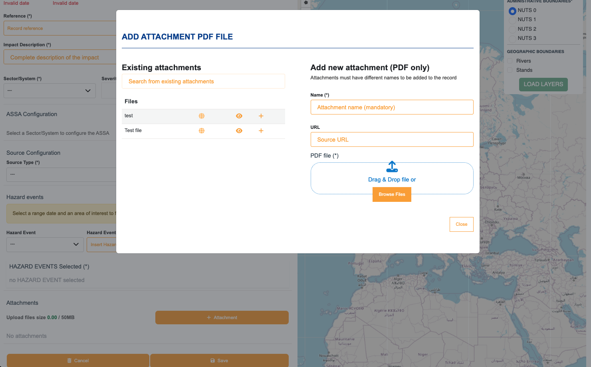
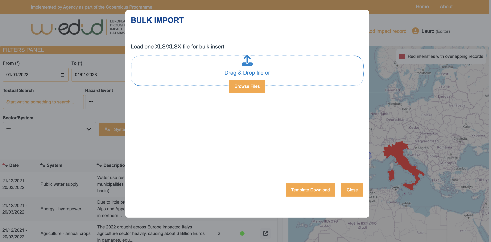

# Table of Contents

[Acronyms](#acronyms)

[List of Figures](#list-of-figures)

[Introduction](#introduction)

[Web application](#w-edid-web-application)

[Use Cases](#use-cases)

[UC.01 – 'Accessing the W-EDID Web Application'](#uc01--accessing-the-w-edid-web-application)

[UC.02 – ‘Querying the EDID Catalogue’](#uc02--querying-the-edid-catalogue)

[UC.02.01 – ‘Setting the Additional System Specific Attributes (ASSA)’](#uc0201--setting-the-additional-system-specific-attributes-assa)

[UC.03 – ‘Manual Insertion of new Drought Impact records’](#uc03--manual-insertion-of-new-drought-impact-records)

[UC.03.01 – ‘Setting the attachment’](#uc0301--setting-the-attachment)

[UC.04 – ‘Bulk insert of a set of impact records by uploading a file’](#uc04--bulk-insert-of-a-set-of-impact-records-by-uploading-a-file)

[UC.05 – ‘Validating Drought Impact records’](#uc05--validating-drought-impact-records)

# Acronyms

| ASSA  | Additional System Specific Attributes                |
|-------|------------------------------------------------------|
| CSS   | Cascading Style Sheets                               |
| CSV   | Comma-Separated Values                               |
| DB    | Database                                             |
| EDID  | European Drought Impacts Database                    |
| FE    | Frontend                                             |
| GIS   | Geographic Information System                        |
| GPL   | General Public License                               |
| GUI   | Graphical User Interface                             |
| HTML  | HyperText Markup Language                            |
| HTTPS | HyperText Transfer Protocol over Secure Socket Layer |
| JSON  | JavaScript Object Notation                           |
| NUTS  | Classification of territorial units for statistics   |
| OGC   | Open Geo-Spatial Consortium                          |
| PDF   | Portable Document Format                             |
| UC    | Use Case                                             |

# List of Figures

[Figure 1 - W-EDID Home Page. Users access the application after
authenticating with the EU Login Identity Provider.](#Ref_Figure1_label_and_number)

[Figure 2 - EU Login Page. Users can enter their credentials or register
to obtain them.](#Ref_Figure2_label_and_number_Copy_1_Copy)

[Figure 3 - W-EDID Search Dashboard. The column “Status” refers to
“valid” attribute in ImpactRecord: green = validated, red = rejected,
yellow = edited, orange = needs validation.](#_Ref129796717_Copy_1)

[Figure 4 - W-EDID Impact Record Detail panel. The “Edit”, “Delete”,
“Validate” buttons appear if the current user is also the original
“Editor” of the record and users with Role = ‘*Validator*’.](#Ref_Figure2_label_and_number_Copy_2)

[Figure 5 - W-EDID ASSA Configurator. Users can refine their query by
configuring a series of Additional System Specific Attributes (ASSA).](#Ref_Figure10_label_and_number)

[Figure 6 - W-EDID Manual Record Entry interface. ASSA configuration
depends on the selected “system”](#_Ref129797792_Copy_1)

[Figure 7 - W-EDID Manual Record Entry interface. Setting the attachment
of a new Impact Record](#_Ref132721725_Copy_1)

[Figure 8- W-EDID Bulk Insert interface.](#_Ref129797918_Copy_1)

#  

#  Introduction

This document represents the user guide for the W-EDID application, a
web-based software tool developed and released to improve the usability
and management of the European Drought Impacts Database (EDID).

Technically, the W-EDID interface is a Web-based GIS application
(Web-GIS) for accessing the EDID. It provides the following core 
functionalities and features:

- User management and profiling;

- Search with advanced filtering;

- Insertion and review new Drought Impact event data;

- Open Geo-Spatial Consortium (OGC) Web Map and Web Feature Services
  (WMS & WFS) support;

- Interoperability features.

Users can geo-locate records through the most common GIS
features (zoom in/out, pan, feature selection, etc.). The
graphical user interface makes available some additional features:

- Data visualization in tables and geo-spatial information on map
  viewers;

- Advanced query to smartly retrieve and browse ‘slices’
  of datasets matching a set of configured filters;

- Map layers overlapping, to better and quickly identify the features of
  interest;

- Intuitive forms for smart data entry and validation.

Authentication is required and the W-EDID functionalities depend on the
user roles.

Different roles can be assigned to authorized users according to user
profiling policies. The following roles are available:

- *Read-only* user: this type of user can explore the database but
  cannot neither insert/modify nor validate new records.

- *Editor* user: this type of user can query the database, enter new
  records but not validate new records. *Editor* users can modify or delete only
  their own records.

- *Validator*: (only) this type of user can enter (like *Editor*),
  delete, modify and validate all records.

- *Administrator*: this type of user has full access to all query and
  functionalities. Administrator is enabled to administrate the platform
  user accounts and permissions, but cannot modify or validate records.

A user can have a combination of roles (Validator + Administrator).

In the following sections, the software use cases will be described in
more detail.

***REMARK: Although the DB structure includes all the necessary objects
related to impact events, the handling of impact events is not
implemented in the current version of the W-EDID platform.***

# W-EDID Web application

## Use Cases

### UC.01 – 'Accessing the W-EDID Web Application'

W-EDID is a public Web Application available through the Internet at the
URL: [**http://edid-test.eu**](http://edid-test.eu/), but only
registered (authorized) users can access it.

Users management and profiling are addressed in detail in the 
"Administrator Manual".

Authorized users access W-EDID by typing the above URL into a common Web
browser tab and land on the application Home Page (Figure 1).

 

*Figure 1 - W-EDID Home Page. Users access the application after authenticating with the EU Login
Identity Provider.*

User authentication process is performed by the EU Login system, the
unified OAuth2 compliant Identity Provider adopted by a wide range of
European Commission web services.

By clicking on the ‘*Login with EU Login*’ button, users are redirected
to the EU Login page (Figure 2), where they can enter their credentials
or register to obtain them (just click on the ‘*Create an account*’
link).

 

*Figure 2 - EU Login Page.*
Users can enter their credentials or register to obtain them.

Finally users with the EU-login cannot automatically enter the platform, 
but must request access the application with *read-only*, *editor* or *validator* 
privileges, by writing to the folliwng email address: 
JRC-EMS-DROUGHT@ec.europa.eu

##
### UC.02 – ‘Querying the EDID Catalogue’

This feature allows all users to retrieve Drought Impact data
of interest available in EDID .

After logging in to the platform, the system displays the Search
Dashboard (Figure 3):

 

*Figure 3 - W-EDID Search*
Dashboard. The column “Status” refers to “valid” attribute in ImpactRecord: green = validated, red = rejected, yellow = edited, orange = needs validation.

1.  The user can enter a free text for searching into attribute “descr”
    of the “ImpactRecord” table;

2.  The user must set the time interval using the two date-pickers
    (mandatory);

3.  The user can set the area of interest by drawing a rectangle on the
    map;

4.  The user can select the impacted system;

5.  The system configures the Additional System Specific Attribute
    (ASSA) panel and populates the lists of Drought Hazard Events
    matching the spatial (map bounding box) and temporal (time interval)
    criteria specified above;

6.  The user can select the severity;

7.  The user can select the Drought Hazard Event: the geometry features
    of the selected Drought Hazard Event appears on the map;

8.  The user can explore different decades of the same Hazard Event on
    the map by acting on the “decade selection panel” (bottom right);

9.  Alternatively, the user can enter the Hazard Event code directly;

10. The user can specify the Additional System Specific Attributes (see
    UC.02.01 – ‘Setting the Additional System Specific Attributes
    (ASSA)’);

11. The user can select the source type from a list (e.g.: firsthand
    information, inventory, media news, modelled impact, government
    report, scientific literature, modelled, NGO report, social media
    and crowdsourcing);

12. The user can save the current filter settings by clicking on the
    ‘*Save Query*’ button: in this case the system opens a pop-up window
    for entering name and description of the query;

13. The user can clear the current filter settings by clicking on the
    ‘*Reset Filters*’ button;

14. The user can submit the query by clicking on the ‘*Search*’ button;

15. The system populates the paged table (10, 25,50 or 100 entries per
    page) of impact records;

16. The user can sort the table rows by clicking on the header;

17. The user with a “Validator” role can set the validation state can
    records listed (“Status column”)

18. The user can select a row in the table: the table row is
    highlighted, and the related geometry features are loaded on the
    map.

19. The user can open the summary panel of the selected impact record,
    by clicking on the diagonal arrow symbol (end of the line, Figure
    4). The summary panel displays relevant information on the selected
    impact record such as: reference map with the administrative limit
    involved, search period (from-to), validation state, reference of
    the record, description, system/sector of the record, severity
    level, list of additional system specific attribute (if any), source
    type, hazard events, attachment (if any) number of NUTS 2 per
    country where impact was recorded, total area in km2. Additional
    details can be displayed by clicking in the box below the map:
    insert and last update time stamp, name of the editor, name of the
    validator, validation time stamp, validation notes, impact records
    ID.

*Figure 4 - W-EDID Impact Record Detail panel.*

20. Alternatively, the user can load a query previously configured by
    clicking on the ‘Import Filter Set*’* button;

21. The system opens a pop-up window containing a table listing name
    and description of all available saved queries;

22. The user can select an entry: in this case, the system pre-fills
    the Search Dashboard according to the filter criteria of the
    query;

24. Only queries saved by the current user can be deleted (other
    queries can be used but not deleted);
##
### UC.02.01 – ‘Setting the Additional System Specific Attributes (ASSA)’

Users can refine their query to the EDID catalogue by setting the value
of a series of Additional System Specific Attributes (ASSA): These
attributed vary depending on the selected system:
<!-- -->

1.  Once system is selected, the user can click on the ‘System Specific
    Attributes (ASSA)’ . The system opens a pop-up window (Figure 5)
    containing the list of attributes configured for the selected
    system.

2.  The user selects an attribute, sets its value (e.g.: input box for
    numbers or strings, list for ranges/classes) and saves it;
  
3.  The system updates the ASSA table;

4.  The user can set other attributes by repeating the procedure
    described above.

 

*Figure 5 –W-EDID ASSA Configurator, example for the Energy-hydropower system. Users can refine
their query by configuring a series of Additional System Specific
Attributes (ASSA).*

##
### UC.03 – ‘Manual Insertion of new Drought Impact records’

Registered users with role of ‘*Editor*’ or ‘*Validator*’ have an
additional functionality available in the main Search Dashboard (Figure
6) allowing them to manually enter new Drought Impact records:

1.  The user clicks on the ‘*Add impact record*’ button on the Home
    page. Note that this option is available to users with the role of
    ‘*Editor*’ or ‘*Validator*’;

2.  The system displays the dedicated form (Figure 6);

<figure>

<figcaption>
Figure 6 - W-EDID Manual Record Entry interface.
ASSA configuration depends on the selected “system”.
</figcaption>
</figure>

3.  The user sets the period “From - To” (**mandatory**), using the 2
    date-pickers;

4.  The user selects the reference, such as name of the newspaper,
    title/autor of the report, etc. (**mandatory**);

5.  The user enters the impact description (**mandatory**);

6.  The user selects the impacted system (**mandatory**);

7.  The user selects the severity (**mandatory**);

8.  The user selects the geometry features on the map viewer according
    to the following procedure:

    1.  The user sets the area of interest by drawing a rectangle on the
        map;

    2.  The user selects at least one of the administrative (NUTS 0-3)
        and/or geographic (watershed, rivers, stand) levels on the map
        layer list;

    3.  The system loads the geo-spatial features belonging to the
        selected layers onto the map viewer;

    4.  The user selects one or more features on the map;

    5.  The system highlights the selected map features.

9.  The system populates the list of Drought Hazard Events matching the
    spatio-temporal criteria specified above;

10. The user can select one or more Drought Hazard Events according to
    the following procedure:

    1.  The user selects the Hazard Event from the list;

    2.  The geometry features of the selected Drought Hazard Event will
        be displayed on the map; alternatively, the user can enter the
        Hazard Event code directly;

    4.  The user can explore different decades of the same Hazard Event
        on the map by acting on the “*decade selection panel*” (bottom
        right);

    5.  The user can confirm the related Hazard Event by clicking on the
        “+” button on the right-hand side of the Hazard Events list; the
        system displays the code of the selected Hazard Events;

    6.  The user can select additional Hazard Events by repeating the
        steps before;

11. The user can unselect a Hazard Event by clicking recycle bin icon.

12. The user selects the source type from a list (e.g.: firsthand
    information, inventory, media news, modelled impact, , government
    report, scientific literature, modelled, NGO report, social media
    and crowdsourcing, etc.);

13. The user can upload );

14. The user can discard the record data by clicking on the ‘*Cancel*’
    button;

15. The user can save the new record data by clicking on the ‘*Save*’
    button. In this case the system stores the record in the DB with all
    associated features, including the link to the selected hazard
    event. If the user has role of ‘*Validator*’ the new record is
    automatically validated.
##
### UC.03.01 – ‘Setting the attachment’

Users can also set the attachment while entering a new Impact Record
(Figure 7):

*Figure 7 - W-EDID Manual Record Entry interface. Setting the attachment of a new Impact Record.*

 1.  The user sets the name (mandatory);
 2. The user can enter the source URL, if available;
 3. The user can alternatively upload a new document (PDF file) or select an existing one by clicking on the ‘*ATTACHMENT*’ button;
 4. In this case, a pop-up window opens (Figure 7) containing:
    1. a list of names of documents already uploaded;
    2. an input box for filtering the list of available documents;
    3. the user can download the .pdf document related to the selected
        attachment name, for a quick check

    4. if the list doesn’t contain the document of interest, a file
        prompt enables the user to select on its local hard drives the
        PDF file to be uploaded;

    5. a button to confirm the operation.

##
### UC.04 – ‘Bulk insert of a set of impact records by uploading a file’

Registered users with role of ‘*Editor*’ or ‘*Validator*’ have an
additional functionality available in the main Search Dashboard (Figure
3) allowing them to insert new Drought Impact records by uploading a
formatted file (Figure 8):

*Figure 8- W-EDID Bulk Insert interface.*

1.  The user clicks on the ‘*Bulk insert*’ button on the Search
    Dashboard (available to users with the role of ‘*Editor*’ or
    ‘*Validator*’!);

19. The system displays the dedicated interface (Figure 8)

20. The user can download the [excel file template](template.xlsx). Only the first sheet
    must be completed and will be considered in the upload process. The
    second sheet contains a guide for the compilation with attribute
    description, formatm examples.

21. The user fills the .xlsx file offline with data to upload;

22. The user clicks on the ‘*Upload*’ button;

23. The system shows a file prompt;

24. The user selects the file on local hard drives and uploads it;

25. The system receives the file and checks that:

    1.  The file format is allowed;

    2.  The file size is within the size limits;

    3.  All required fields are available (ignores any column with
        unknown header );

    4.  Values are in the right format given the column (number, text,
        etc.);

    5.  Each record has all the mandatory fields filled;

26. Records not compliant with the above requirements are skipped and
    logged in a json file available for download. The system checks for
    identical records already present in the DB and skips those (this to
    prevent against multiple uploads of a same file);

27. In case two or more records differ only by geometries the system
    merges the geometries into a single geometry collection of the
    impact record;

28. The system saves the valid records and prompts a window with a
    message to the user and a downloadable log file with the check
    outcome (including those records left out because not in the right
    format).

29. If the user has role of ‘Validator’ the imported records are
    automatically validated.

Only files with the following formats are admitted:

- Excel file: geometries are listed by code (for NUTS, a single column
  is enough, but all levels are allowed). The possible fields are:

<!-- -->

- source

- source_type

- reference

- date_oe

- imp_sys

- imp_des

- imp_sev

- NUTS

- watershed

- river

- stand

- year

- season

- month

- day

> Additional columns for each additional system-specific attribute
> (ASSA) can be added. List of headers and template are described in the
> second sheet of the [excel file template](template.xlsx).
>
> Attachments are not allowed in bulk upload.
##
### UC.05 – ‘Validating Drought Impact records’

New Drought Impact records entered by users not holding the role of
‘*Validator*’ require validation prior to being available on the
platform, regardless of the procedure used (i.e. manual insertion or
file upload).

Registered users with the role of ‘*Validator*’ are therefore
responsible for validating the new Impact records:

1.  The user accesses Impact Record Detail panel (Figure 6);

2.  The user can validate the selected record by clicking on the
    ‘*Validate*’ button.

##
